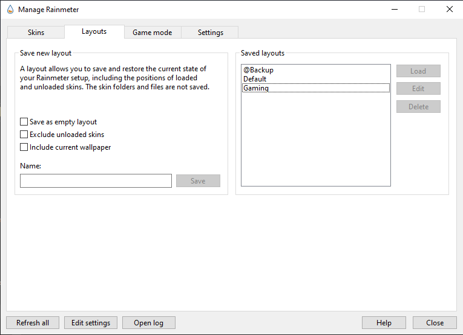
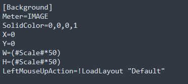

# Rainmeter game mode button

## What is this?

* This is just a button which allow you to change layout faster.

	* I created this because I think most of people was a gamer but love to use rainmeter for their desktop to customization the OS but sometime rainmeter affect to their gaming experience (Drop FPS, laggy) or they want to turn all skins off to save the battery life on their laptop!

## Installation

* Attention:

	

		
This skins only change 2 layout

			 
			Although this skins will create a button allow you to change between layout faster but I created this for gaming only. That also mean it can change 1 layout for one *.ini file (Total 2 files: On and Off).
	

> After install this skin, set up your skins first.
>
> Move to 'Layout' tab
>
> Name your layout (E.g: Default) and save it
>
> After saved your first layout, tick check box 'Save as empty layout' and name your new layout again (E.g: Gaming) and save it!
>
> Apply the second layout that you had made (Gaming layout)
>
> Load *.ini* file (Only choose On or Off base on your config)
>
> Then you just press the icon on the desktop, after press it will change your current layout to other layout that you had set up before!

## Q&A

* This is some questions that you might want to ask!ư

	

			
Q: Can I change the icon?

			 
			A: You can chang the icon via @Resources folder. Also if you want to change to other layout (Not for gaming), just open the *.ini file and head to 'LeftMouseUpAction' and change the layout to your layout (e.g: Change the 'Gaming' to 'Best layout')
	

	

			
Q: Why don't you created a button that can changed multiple layout?

			 
			A: Actually, this skins was based from <a href="https://github.com/mpurses/Sonder">Sonder</a> for the background icon and <a href="https://forum.rainmeter.net/viewtopic.php?t=16838">Quick change multiple layout using button</a>. I can created more but I think it is not necessary because many people only use 1 layout for their skin. Also I think that it's very hard to create a skins which can changed more than 2 layout (I can do it but it's UI problem).
	

	

			
Q: But I have more than 2 layout, and I did not focus too much about the UI. How can I create a skin which can change layout quickly?

			 
			A: You can check <a href="https://forum.rainmeter.net/viewtopic.php?t=18937#p102376">here</a> for more information.
	

	

			
Q: I don't want to use layout named 'Gaming' or 'Default', can I change it to other name or I force to use that name?

			 
			A: You can chang the name of your layout in rainmeter first. Then you can open the .ini file. Head to 'LeftMouseUpAction' and you will see the layout named. ('Gaming' or 'Default' base on your file you open). All you have to do is just rename that layout named you had set!
	

	

## License

<h6 algin="center">Maybe it didn't necessary, right? ^^</h6>

